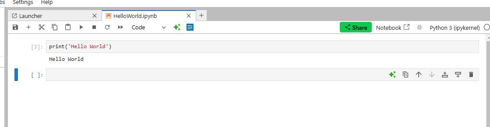
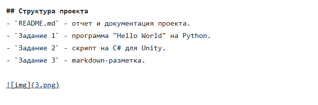

# АНАЛИЗ ДАННЫХ И ИСКУССТВЕННЫЙ ИНТЕЛЛЕКТ [in GameDev]
Отчет по лабораторной работе #1 выполнил(а):
- Суворов Денис Сергеевич
- РИ-230936
Отметка о выполнении заданий (заполняется студентом):

| Задание | Выполнение | Баллы |
| ------ | ------ | ------ |
| Задание 1 | * | 60 |
| Задание 2 | * | 20 |
| Задание 3 | * | 20 |

знак "*" - задание выполнено; знак "#" - задание не выполнено;

Работу проверили:
- к.т.н., доцент Денисов Д.В.
- к.э.н., доцент Панов М.А.
- ст. преп., Фадеев В.О.

[](https://nodesource.com/products/nsolid)

[](https://travis-ci.org/joemccann/dillinger)

Структура отчета

- Данные о работе: название работы, фио, группа, выполненные задания.
- Цель работы.
- Задание 1.
- Код реализации выполнения задания. Визуализация результатов выполнения (если применимо).
- Задание 2.
- Код реализации выполнения задания. Визуализация результатов выполнения (если применимо).
- Задание 3.
- Код реализации выполнения задания. Визуализация результатов выполнения (если применимо).
- Выводы.
- ✨Magic ✨

## Цель работы
Установить необходимое программное обеспечение, которое пригодится для создания интеллектуальных моделей на Python. Рассмотреть процесс установки игрового движка Unity для разработки игр.

## Задание 1
### Выберите одну из игровых переменных в игре СПАСТИ РТФ: Выживание (HP, SP, игровая валюта, здоровье и т.д.), опишите её роль в игре, условия изменения / появления и диапазон допустимых значений. Постройте схему экономической модели в игре и укажите место выбранного ресурса в ней.
Описание роли в игре:

# 1. Роль здоровья (HP) в игре:
    Здоровье (HP) — это основной показатель выживания персонажа. Оно показывает, сколько урона может выдержать персонаж, прежде чем погибнуть.
    Когда здоровье (HP) опускается до нуля, персонаж умирает, что может привести к различным последствиям в игре.
    Восстановление HP обычно связано с использованием определённых предметов (например, вампиризма).

# 2. Условия изменения / появления здоровья:
    Снижение HP: Происходит, когда персонаж получает урон в бою, сталкивается с зомби,  или подвержен другим вредоносным воздействиям.
    Увеличение HP: Восстанавливается при получение навыка «Вампиризм», использовании таблеток, или использование «увеличения здоровья».
    Исчезновение HP (смерть): HP падает до 0, если персонаж не успевает восстановить здоровье. Это ведёт к потере прогресса.

# 3. Диапазон допустимых значений здоровья:
    HP обычно варьируется от 0 до определённого максимума. Значение 0 означает смерть персонажа.
    Максимальное значение может быть увеличено при помощи бонусов, например, приобретённых предметов или навыков.

# 4. Схема экономической модели с игровой валютой



Кран: источники получения валюты.
Инвентарь: в инвентаре хранится валюта, которую игрок собирает в ходе игры.
Магазин: это место, где игрок может обменять свою валюту на другие ресурсы.
Труба: символизирует движение валюты — её получение или трату


## Задание 2
### С помощью скрипта на языке Python заполните google-таблицу данными, описывающими выбранную игровую переменную в игре “СПАСТИ РТФ:Выживание”. Средствами google-sheets визуализируйте данные в google-таблице (постройте график / диаграмму и пр.) для наглядного представления выбранной игровой величины. Опишите характер изменения этой величины, опишите недостатки в реализации этой величины (например, в игре может произойти условие наступления эксплойта) и предложите до 3-х вариантов модификации условий работы с переменной, чтобы сделать игровой опыт лучше.

```csharp

using UnityEngine;

public class HelloWorld : MonoBehaviour
{
    void Start()
    {
        Debug.Log("Hello, World!");
    }
}

```


## Задание 3
### Настройте на сцене Unity воспроизведение звуковых файлов, описывающих динамику изменения выбранной переменной. Например, если выбрано здоровье главного персонажа вы можете выводить сообщения, связанные с его состоянием.


## Структура проекта
- `README.md` - отчет и документация проекта.
- `Задание 1` - программа "Hello World" на Python.
- `Задание 2` - скрипт на C# для Unity.
- `Задание 3` - markdown-разметка.





## Выводы

Во всех заданиях рассматривается одна игровая переменная (здоровье, HP) из игры "СПАСТИ РТФ: Выживание". В первом задании она изучена как элемент экономической модели, во втором проведён анализ её изменений с визуализацией и предложениями по улучшению игрового опыта. В третьем — реализована аудиальная поддержка через Unity .


P.s - музыка зачет))

## Powered by

**BigDigital Team: Denisov | Fadeev | Panov**
