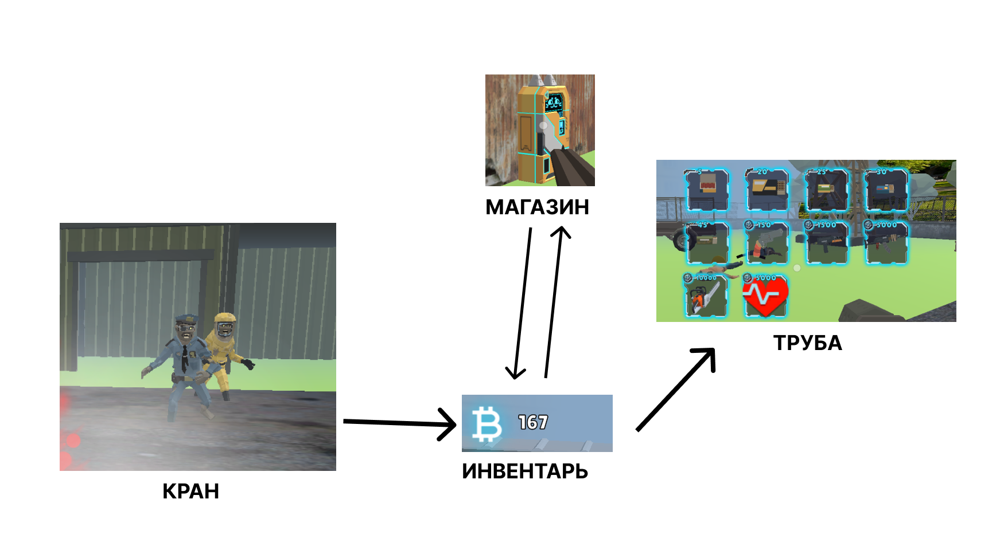
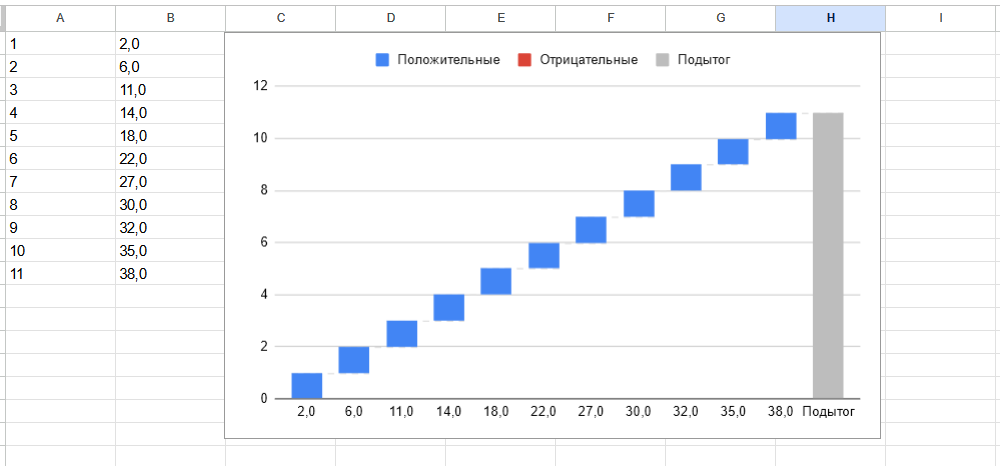

# АНАЛИЗ ДАННЫХ И ИСКУССТВЕННЫЙ ИНТЕЛЛЕКТ [in GameDev]
Отчет по лабораторной работе #2 выполнил(а):
- Суворов Денис Сергеевич
- РИ-230936
Отметка о выполнении заданий (заполняется студентом):

| Задание | Выполнение | Баллы |
| ------ | ------ | ------ |
| Задание 1 | * | 60 |
| Задание 2 | * | 20 |
| Задание 3 | * | 20 |

знак "*" - задание выполнено; знак "#" - задание не выполнено;

Работу проверили:
- к.т.н., доцент Денисов Д.В.
- к.э.н., доцент Панов М.А.
- ст. преп., Фадеев В.О.

[](https://nodesource.com/products/nsolid)

[](https://travis-ci.org/joemccann/dillinger)

Структура отчета

- Данные о работе: название работы, фио, группа, выполненные задания.
- Цель работы.
- Задание 1.
- Код реализации выполнения задания. Визуализация результатов выполнения (если применимо).
- Задание 2.
- Код реализации выполнения задания. Визуализация результатов выполнения (если применимо).
- Задание 3.
- Код реализации выполнения задания. Визуализация результатов выполнения (если применимо).
- Выводы.
- ✨Magic ✨

## Цель работы
Научиться передавать данные из Google таблицы  в Unity с помощью Python.

## Задание 1
### Выберите одну из игровых переменных в игре СПАСТИ РТФ: Выживание (HP, SP, игровая валюта, здоровье и т.д.), опишите её роль в игре, условия изменения / появления и диапазон допустимых значений. Постройте схему экономической модели в игре и укажите место выбранного ресурса в ней.
Описание роли в игре:

## 1. Роль игровой валюты в игре:

    Игровая валюта — это универсальный ресурс, который используется для покупки предметов, улучшений и услуг,
    необходимых для прогресса персонажа. Валюта является основной движущей силой экономики игры,
    так как через неё происходит большинство торговых операций.

## 2. Условия изменения / появления игровой валюты:

    Получение валюты: За выполнение заданий, успешные сражения с зомби, поиск сундуков с деньгами.
    Трата валюты: Игрок тратит валюту на покупку предметов, оружия, улучшений, а также на оплату услуг (например, патроны, лечение).

## 3. Диапазон допустимых значений валюты:

    Обычно диапазон игровой валюты не имеет жёсткого максимума. Игрок может накапливать практически неограниченное количество,
    хотя могут быть ограничения на отдельные типы валюты. У игрока может быть несколько видов валюты ,
    каждая из которых имеет свою ценность и предназначение.

### 4. Схема экономической модели с игровой валютой



- `Кран:` источники получения валюты.
- `Инвентарь:` в инвентаре хранится валюта, которую игрок собирает в ходе игры.
- `Магазин:` это место, где игрок может обменять свою валюту на другие ресурсы.
- `Труба:` символизирует движение валюты — её получение или трату


## Задание 2
### С помощью скрипта на языке Python заполните google-таблицу данными, описывающими выбранную игровую переменную в игре “СПАСТИ РТФ:Выживание”. Средствами google-sheets визуализируйте данные в google-таблице (постройте график / диаграмму и пр.) для наглядного представления выбранной игровой величины. Опишите характер изменения этой величины, опишите недостатки в реализации этой величины (например, в игре может произойти условие наступления эксплойта) и предложите до 3-х вариантов модификации условий работы с переменной, чтобы сделать игровой опыт лучше.

```py

import gspread
import numpy as np
import  random as rnd

gc = gspread.service_account(filename='unitydatasciense-437112-0856780b7dd1.json')
sh = gc.open("UnitySheets")
money = 0
mon = list(range(1, 11))
i = 0

while i <= len(mon):
    test = rnd.randint(2, 5)
    i += 1
    money = float(money)
    money += test
    sh.sheet1.update (('A' + str(i)), [[str(i)]])
    sh.sheet1.update (('B' + str(i)), [[str(money).replace('.',',')]])
    print(money)

```




## Задание 3
### Настройте на сцене Unity воспроизведение звуковых файлов, описывающих динамику изменения выбранной переменной. Например, если выбрано здоровье главного персонажа вы можете выводить сообщения, связанные с его состоянием.

## Структура проекта unity
```csharp
void Update()
    {
        // Проверяем, что данные загружены и ключ существует
        if (dataLoaded && dataset.ContainsKey("Mon_" + i.ToString()))
        {
            if (dataset["Mon_" + i.ToString()] <= 10 && !statusStart && i != dataset.Count)
            {
                StartCoroutine(PlaySelectAudioGood());
                Debug.Log(dataset["Mon_" + i.ToString()]);
            }

            if (dataset["Mon_" + i.ToString()] > 10 && dataset["Mon_" + i.ToString()] < 100 && !statusStart && i != dataset.Count)
            {
                StartCoroutine(PlaySelectAudioNormal());
                Debug.Log(dataset["Mon_" + i.ToString()]);
            }

            if (dataset["Mon_" + i.ToString()] >= 100 && !statusStart && i != dataset.Count)
            {
                StartCoroutine(PlaySelectAudioBad());
                Debug.Log(dataset["Mon_" + i.ToString()]);
            }
        }
    }

```


## Выводы

Освоил работу с таблицами через Python, научился интегрировать их в Unity и настраивать взаимодействие.


`P.s - музыка зачет))`

## Powered by

**BigDigital Team: Denisov | Fadeev | Panov**
