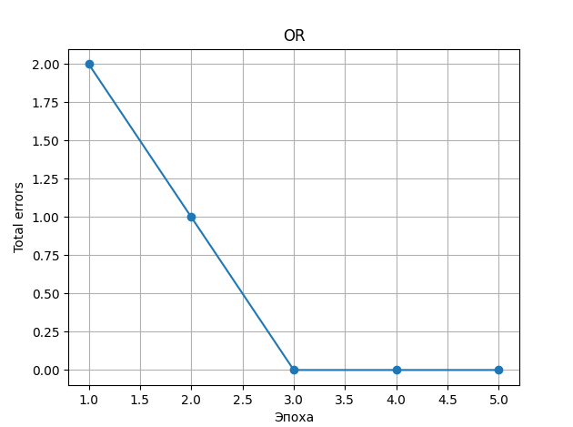
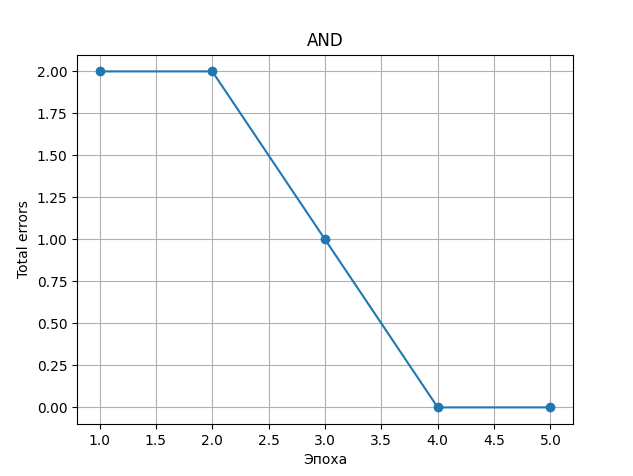
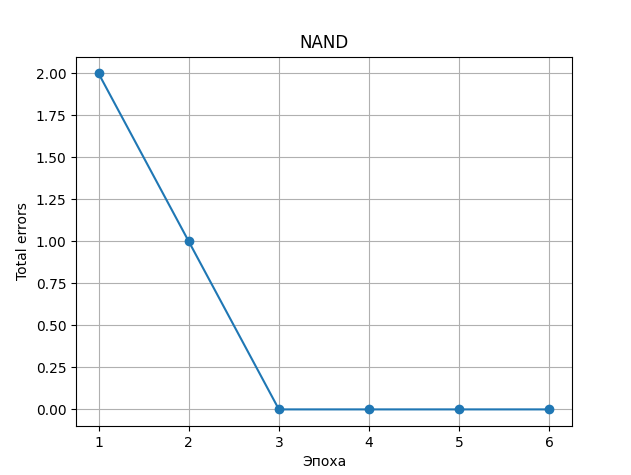
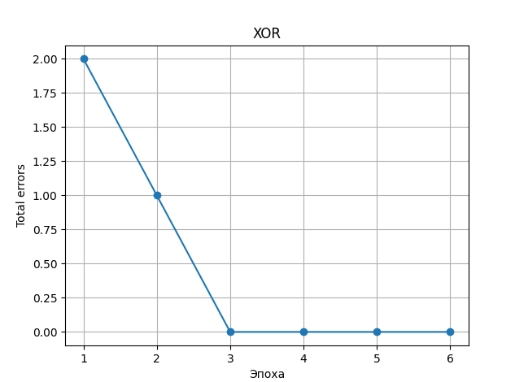

# АНАЛИЗ ДАННЫХ И ИСКУССТВЕННЫЙ ИНТЕЛЛЕКТ [in GameDev]
Отчет по лабораторной работе #4 выполнил(а):
- Суворов Денис Сергеевич
- РИ-230936
Отметка о выполнении заданий (заполняется студентом):

| Задание | Выполнение | Баллы |
| ------ | ------ | ------ |
| Задание 1 | * | 60 |
| Задание 2 | * | 20 |
| Задание 3 | * | 20 |

знак "*" - задание выполнено; знак "#" - задание не выполнено;

Работу проверили:
- к.т.н., доцент Денисов Д.В.
- к.э.н., доцент Панов М.А.
- ст. преп., Фадеев В.О.

Структура отчета

- Данные о работе: название работы, фио, группа, выполненные задания.
- Цель работы.
- Задание 1.
- Код реализации выполнения задания. Визуализация результатов выполнения (если применимо).
- Задание 2.
- Код реализации выполнения задания. Визуализация результатов выполнения (если применимо).
- Задание 3.
- Код реализации выполнения задания. Визуализация результатов выполнения (если применимо).
- Выводы.
- ✨Magic ✨

## Цель работы
### Сделать все 3 задания.

# Задание 1: в проекте Unity реализовать перцептрон, который умеет производить вычисления:
`OR | дать комментарии о корректности работы:`

- Перцептрон успешно справляется с задачей обучения операции OR. Эта операция линейно разделима, поэтому веса перцептрона могут быть настроены так, чтобы корректно классифицировать входные данные. После завершения обучения модель выдает результаты, соответствующие таблице истинности. Величина ошибки после нескольких эпох обучения стремится к нулю, что подтверждает корректность работы.

`AND | дать комментарии о корректности работы:`

- Аналогично OR, функция AND также линейно разделима, что делает ее хорошо подходящей для реализации однослойным перцептроном. После обучения модель корректно различает входные данные, выдавая значения, которые совпадают с таблицей истинности. Если количество эпох обучения достаточно, а случайная инициализация весов не мешает, результат полностью соответствует ожидаемому.

`NAND | дать комментарии о корректности работы:`

- NAND, будучи обратной операцией для AND, также является линейно разделимой функцией. Перцептрон корректно обучается этой операции, так как изменение весов и смещения позволяет адаптировать модель под эту задачу. После успешного обучения модель демонстрирует стабильные результаты, которые совпадают с таблицей истинности.

`XOR | дать комментарии о корректности работы:`

- Перцептрон не может корректно обучиться функции XOR, так как эта операция нелинейно разделима. Входные данные для XOR невозможно разделить одной прямой линией в двумерном пространстве, что является фундаментальным ограничением однослойного перцептрона.

# Задание 2: Построить графики зависимости количества эпох от ошибки  обучения. Указать от чего зависит необходимое количество эпох обучения.

## Код python "графики"

# Задание 3: Построить визуальную модель работы перцептрона на сцене Unity.

В проекте на Unity реализована увлекательная визуализация работы перцептронов с использованием двух кубов. Каждый куб выступает носителем объекта перцептрона, к которому можно привязать конкретный номер входа через инспектор (нумерация начинается с 0). По мере взаимодействия кубы реагируют на изменения входных данных, меняя цвет: белый сигнализирует о значении 0, а черный — о значении 1. 

### картинка поглощения одного куба другого 

## Выводы

Научлися применять нейронку в юнити и играться с кубиками

`P.s - 🍋‍🟩`

## Powered by

**BigDigital Team: Denisov | Fadeev | Panov**
